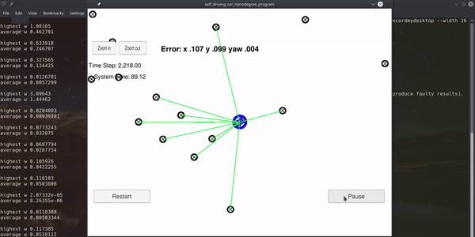

## Kidnapped Vehicle (Self-Driving Car Engineer Nanodegree)

In this project, a 2 dimensional particle filter is implemented. It will be given a map and some initial localization information 
(analogous to what a GPS would provide). At each time step the particle filter will also get observation and control data. 

This project involves the Udacity Self-Driving Car Engineer Nanodegree Term 2 Simulator which can be downloaded from [here](https://github.com/udacity/self-driving-car-sim/releases).


#### Dependencies

* cmake >= 3.5
* make >= 4.1 (Linux, Mac), 3.81 (Windows)
* gcc/g++ >= 5.4
* [uWebSocketIO](https://github.com/uWebSockets/uWebSockets) with commit hash e94b6e1


#### Build
The Particle Filter program can be built and run by doing the following from the project top directory.

```bash
$> mkdir build
$> cd build
$> cmake ..
$> make
```
or
```bash
$> ./build.sh
```

#### Run
Run from the project top directory.

```bash
$> build/particle_filter
```
or
```bash
$> ./run.sh
```

#### Clean
Run from the project top directory.

```bash
$> rm --recursive --force build
```
or
```bash
$> ./clean.sh
```

#### Demo



#### Protocol
Below is the main protcol that main.cpp uses for uWebSocketIO in communicating with the simulator.


*INPUT*: values provided by the simulator to the C++ program.
```
// sense noisy position data from the simulator
["sense_x"] 
["sense_y"] 
["sense_theta"] 

// get the previous velocity and yaw rate to predict the particle's transitioned state
["previous_velocity"]
["previous_yawrate"]

// receive noisy observation data from the simulator, in a respective list of x/y values
["sense_observations_x"] 
["sense_observations_y"] 
```

*OUTPUT*: values provided by the C++ program to the simulator.
```
// best particle values used for calculating the error evaluation
["best_particle_x"]
["best_particle_y"]
["best_particle_theta"] 

//Optional message data used for debugging particle's sensing and associations
// for respective (x,y) sensed positions ID label 
["best_particle_associations"]

// for respective (x,y) sensed positions
["best_particle_sense_x"] <= list of sensed x positions
["best_particle_sense_y"] <= list of sensed y positions
```

#### Input Data
You can find the inputs to the particle filter in the [data/map_data.txt](./data/map_data.txt) file. 
It includes the position of landmarks (in meters) on an arbitrary Cartesian coordinate system. Each row has three columns:
1. x position
2. y position
3. landmark id

All other data, such as observations and controls, is provided by the simulator. Map data is provided by 3D Mapping Solutions GmbH.


#### Notice
For comprehensive instructions on how to install and run project, please, refer to the following repo, which was used as a skeleton for this project: https://github.com/udacity/CarND-Kidnapped-Vehicle-Project.
